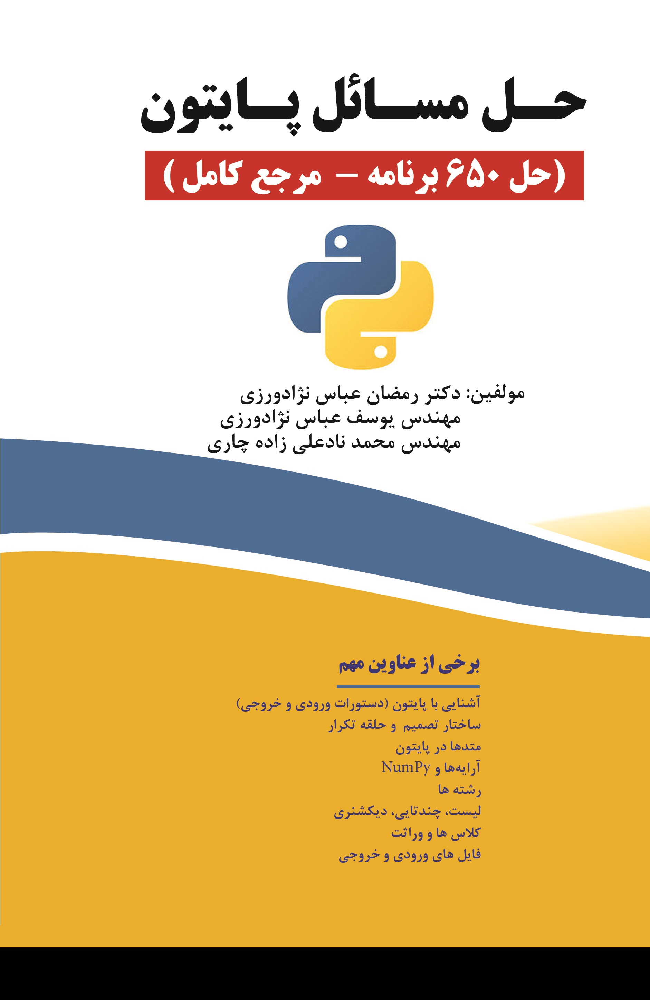

# Solutions to Programming Problems in Go

Welcome to the repository where we provide solutions to the problems from the Persian book "حل المسائل پایتون (حل 650 برنامه)" (Solutions to Python Problems: Solving 650 Programs). This repository contains solutions written in Go.

## Goal of the Repository

The main goal of this repository is to offer solutions to the programming problems in the mentioned book using the Go programming language. This serves as a resource for those who are learning Go and want to see practical implementations of various programming problems.

## Contribution Guidelines

We welcome contributions from developers who are interested in solving these problems in other programming languages (except Python). If you would like to contribute:

1. Select a problem from the book.
2. Solve it in your preferred programming language.
3. Create a README file for your solution in the chosen language (e.g., English, French, German) to ensure accessibility for a wider audience.
4. Submit a pull request with your solution and the README file.

## Acknowledgements

Special thanks to the authors of the book "حل المسائل پایتون (حل 650 برنامه)" for providing an excellent resource for learning and practicing Python programming:

- رمضان عباس نژادورزی (Ramazan Abbas Nejad Varzi)
- محمد نادعلی‌زاده چاری (Mohammad Nadali Zadeh Chari)
- یوسف عباس نژادورزی (Yousef Abbas Nejad Varzi)

Your contributions have been invaluable in creating this repository and helping developers expand their programming skills in multiple languages.
